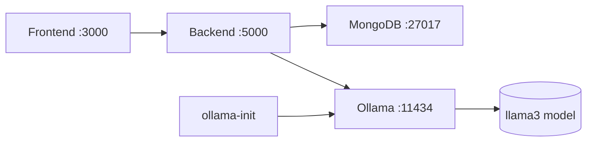

# 🎓 AI Placement Mentor

An AI-powered full-stack web application for placement preparation, featuring smart resume analysis, mock interviews, skill gap analysis, personalized career roadmaps, and AI career counseling. Runs completely **offline** using local **Ollama** models — no cloud AI dependency.

## Tech Stack

### Frontend
- **Next.js 15** with App Router
- **TypeScript**
- **Tailwind CSS** with Shadcn UI components
- **JWT Authentication** (local, no cloud dependency)
- **Zustand** for state management

### Backend
- **Node.js** with **Express.js**
- **TypeScript**
- **MongoDB** with **Mongoose**
- **JWT + bcrypt** for authentication
- **Ollama** (local AI via REST API)

### AI (Local — no cloud)
- **Ollama** with `llama3` (primary) and `gemma` (fallback)
- Fully offline after model download
- All AI features use Ollama REST API at `/api/generate`

### Deployment
- **Containers**: Docker & Docker Compose (recommended)
- **Frontend**: Vercel (optional)
- **Backend**: Render (optional)
- **Database**: MongoDB Atlas or local MongoDB

## Features

1. **Authentication** - Local JWT auth with email/password, protected routes
2. **Dashboard** - Placement readiness score, progress tracking, skill analytics
3. **Smart Resume Analyzer** - ATS scoring, keyword analysis, missing skills detection
4. **AI Mock Interview** - HR & Technical modes, dynamic questions, scoring, feedback
5. **Skill Gap Analysis** - Target role matching, personalized recommendations
6. **Career Roadmap** - Weekly learning plans, milestones, project suggestions
7. **AI Career Counselor** - Chat interface powered by Ollama, career guidance
8. **Admin Panel** - User analytics, placement statistics, engagement metrics

## Project Structure

```
ai-placement-mentor/
├── frontend/                    # Next.js 15 application
│   ├── src/
│   │   ├── app/                 # App router pages
│   │   │   ├── auth/            # Login & Register
│   │   │   ├── dashboard/       # Main dashboard
│   │   │   ├── resume-analyzer/ # Resume analysis
│   │   │   ├── mock-interview/  # HR & Technical interviews
│   │   │   ├── skill-gap/       # Skill gap analysis
│   │   │   ├── roadmap/         # Career roadmap
│   │   │   ├── counselor/       # AI chat counselor
│   │   │   ├── admin/           # Admin panel
│   │   │   └── profile/         # User profile
│   │   ├── components/          # Reusable components
│   │   │   ├── ui/              # Shadcn UI components
│   │   │   └── layout/          # Sidebar, Navbar
│   │   ├── lib/                 # Utilities, API client
│   │   ├── store/               # Zustand stores
│   │   ├── types/               # TypeScript types
│   │   └── providers/           # Theme & Auth providers
│   ├── public/
│   └── Dockerfile
├── backend/                     # Express.js API
│   ├── src/
│   │   ├── config/              # Database, Ollama config
│   │   ├── controllers/         # Route handlers
│   │   ├── middleware/           # Auth, error handling, uploads
│   │   ├── models/              # Mongoose schemas
│   │   ├── routes/              # Express routers
│   │   ├── services/            # Business logic, Ollama integration
│   │   ├── types/               # TypeScript interfaces
│   │   └── app.ts              # Server entry point
│   └── Dockerfile
├── docker-compose.yml
└── README.md
```

## Prerequisites

- **Docker & Docker Compose** (recommended — runs everything including Ollama)
- Or manually:
  - Node.js 18+
  - MongoDB (local or Atlas)
  - [Ollama](https://ollama.ai) installed locally

## Quick Start (Recommended — Docker)

```bash
# 1. Clone
git clone https://github.com/yourusername/ai-placement-mentor.git
cd ai-placement-mentor

# 2. Create environment file
cp .env.example .env
# Edit .env if needed (defaults work out of the box)

# 3. Start everything — Frontend, Backend, MongoDB, Ollama
docker compose up -d

# 4. Wait a moment for Ollama to pull the model (~2-5 min first time)
docker compose logs -f ollama-init

# 5. Open the app
open http://localhost:3000
```

> **First startup** automatically:
> - Starts MongoDB
> - Starts Ollama and pulls `llama3` (or `gemma` fallback)
> - Waits for the model to be ready
> - Starts the backend with all AI features
> - Starts the frontend

## Manual Setup (without Docker)

### 1. Install & Start Ollama

```bash
# Install Ollama: https://ollama.ai
ollama pull llama3
ollama serve
```

### 2. Backend

```bash
cd backend
cp .env.example .env
# Edit OLLAMA_BASE_URL if needed (default: http://localhost:11434)
npm install
npm run dev
```

### 3. Frontend

```bash
cd frontend
cp .env.local.example .env.local
npm install
npm run dev
```

### 4. Access

- Frontend: http://localhost:3000
- Backend API: http://localhost:5000/api/v1
- Health: http://localhost:5000/health
- Ollama models: http://localhost:5000/health/models

## Docker Compose Architecture



| Service | Port | Description |
|---------|------|-------------|
| `frontend` | 3000 | Next.js 15 app |
| `backend` | 5000 | Express.js API |
| `mongodb` | 27017 | Database |
| `ollama` | 11434 | Local AI |
| `ollama-init` | — | One-time model pull |

## API Documentation

### Authentication

| Method | Endpoint | Description | Auth |
|--------|----------|-------------|------|
| POST | `/api/v1/auth/register` | Register new user | No |
| POST | `/api/v1/auth/login` | Login (returns JWT) | No |
| GET | `/api/v1/auth/profile` | Get user profile | Yes |
| PUT | `/api/v1/auth/profile` | Update profile | Yes |
| GET | `/api/v1/auth/users` | List all users (admin) | Admin |

### Resume Analysis

| Method | Endpoint | Description | Auth |
|--------|----------|-------------|------|
| POST | `/api/v1/resumes/upload` | Upload & analyze resume | Yes |
| GET | `/api/v1/resumes` | Get all resumes | Yes |
| GET | `/api/v1/resumes/:id` | Get resume by ID | Yes |
| DELETE | `/api/v1/resumes/:id` | Delete resume | Yes |

### Mock Interviews

| Method | Endpoint | Description | Auth |
|--------|----------|-------------|------|
| POST | `/api/v1/interviews/start` | Start new interview | Yes |
| POST | `/api/v1/interviews/answer` | Submit answer | Yes |
| POST | `/api/v1/interviews/:id/complete` | Complete interview | Yes |
| GET | `/api/v1/interviews` | Get all interviews | Yes |
| GET | `/api/v1/interviews/:id` | Get interview details | Yes |

### Skill Gap Analysis

| Method | Endpoint | Description | Auth |
|--------|----------|-------------|------|
| POST | `/api/v1/skills/analyze` | Analyze skill gap | Yes |
| GET | `/api/v1/skills` | Get all assessments | Yes |
| GET | `/api/v1/skills/:id` | Get assessment details | Yes |

### Career Roadmap

| Method | Endpoint | Description | Auth |
|--------|----------|-------------|------|
| POST | `/api/v1/roadmaps/generate` | Generate new roadmap | Yes |
| GET | `/api/v1/roadmaps` | Get all roadmaps | Yes |
| GET | `/api/v1/roadmaps/:id` | Get roadmap details | Yes |
| PUT | `/api/v1/roadmaps/:id/progress` | Update week progress | Yes |

### AI Counselor

| Method | Endpoint | Description | Auth |
|--------|----------|-------------|------|
| POST | `/api/v1/counselor/chat` | Send message | Yes |
| GET | `/api/v1/counselor/history` | Get chat history | Yes |
| DELETE | `/api/v1/counselor/history` | Clear history | Yes |

### Dashboard

| Method | Endpoint | Description | Auth |
|--------|----------|-------------|------|
| GET | `/api/v1/dashboard` | Student dashboard | Yes |
| GET | `/api/v1/dashboard/admin` | Admin dashboard | Admin |

## Ollama Setup

The application uses **Ollama** for all AI features. The Docker setup handles this automatically.

### Manual Ollama Installation

```bash
# Install Ollama
curl -fsSL https://ollama.ai/install.sh | sh

# Pull the required models
ollama pull llama3
ollama pull gemma

# Start Ollama server
ollama serve
```

### Verifying Ollama

```bash
# Check Ollama is running
curl http://localhost:11434/api/tags

# Should return a list of pulled models
```

### Configuration

| Variable | Default | Description |
|----------|---------|-------------|
| `OLLAMA_BASE_URL` | `http://ollama:11434` | Ollama server URL |
| `OLLAMA_MODEL` | `llama3` | Primary AI model |
| `OLLAMA_FALLBACK_MODEL` | `gemma` | Fallback if primary fails |
| `OLLAMA_MAX_RETRIES` | `3` | Retry attempts on failure |
| `OLLAMA_TIMEOUT` | `120000` | Request timeout in ms |

## Health Endpoints

| Endpoint | Description |
|----------|-------------|
| `GET /health` | Overall health |
| `GET /health/ollama` | Ollama connectivity |
| `GET /health/models` | Available models |

## Deployment

### Vercel (Frontend)

```bash
cd frontend
npx vercel --prod
```

Set environment variables in Vercel dashboard.

### Render (Backend)

1. Create a new Web Service on Render
2. Connect your repository
3. Use the included `render.yaml` or set manually:
   - Build Command: `cd backend && npm install && npm run build`
   - Start Command: `cd backend && npm start`
   - Add all environment variables

## License

MIT
